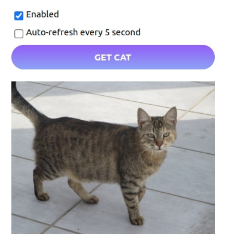

# Проект для получения котиков из API

Используя технологии React (минимум три-компонента), styled-components.com и внешнее Rest-API (thecatapi.com) реализовать  по макету https://prnt.sc/s3b9ad.

Когда чекбокс Enabled не отмечен, кнопка чекбокс Auto-Refresh и кнопка Get cat блокируются. При перезагрузке страницы чекбокс Enabled находится в состоянии сhecked, и как следствие кнопка чекбокс Auto-Refresh и кнопка Get cat не блокируются.
Если второй чекбокс Auto-Refresh находится в состоянии Checked, то каждый 5 сек происходит перезагрузка картинки.

